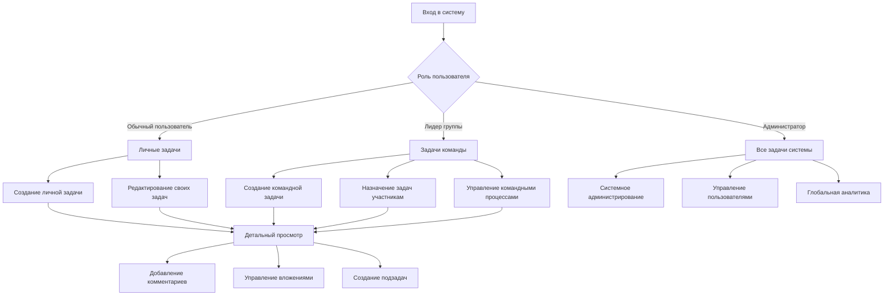

# Требования к продукту: Переработка модуля управления задачами

## 1. Обзор продукта

Полная переработка модуля управления задачами с применением современных практик из популярных сервисов (Asana, Jira, Monday.com). Система обеспечивает эффективное управление задачами с четким разграничением прав доступа и поддержкой вложенных подзадач.

Основная цель - создать интуитивно понятный и мощный инструмент для управления задачами, который масштабируется от индивидуального использования до командной работы и корпоративного уровня.

## 2. Основные функции

### 2.1 Пользовательские роли

| Роль                 | Метод регистрации          | Основные права                                                              |
| -------------------- | -------------------------- | --------------------------------------------------------------------------- |
| Обычный пользователь | Email регистрация          | Создание и назначение задач только себе, просмотр назначенных задач         |
| Лидер группы         | Назначение администратором | Управление задачами всех участников своей группы, создание командных задач  |
| Администратор        | Системное назначение       | Полный доступ ко всем задачам системы, управление пользователями и группами |

### 2.2 Модули функций

Наши требования к переработанному модулю задач состоят из следующих основных страниц:

1. **Главная страница задач**: навигационное меню, фильтры и поиск, таблица задач с возможностью inline-редактирования, массовые операции
2. **Страница создания задачи**: форма создания с валидацией, выбор исполнителя (с учетом прав), настройка приоритета и сроков, добавление тегов и вложений
3. **Детальная страница задачи**: полная информация о задаче, управление подзадачами, история изменений, комментарии и обсуждения
4. **Канбан-доска**: визуальное представление задач по статусам, drag-and-drop перемещение, быстрое создание задач
5. **Календарный вид**: отображение задач по срокам выполнения, планирование и перепланирование
6. **Страница настроек**: управление командами и правами, настройка уведомлений, персонализация интерфейса

### 2.3 Детали страниц

| Название страницы         | Название модуля        | Описание функций                                                                                    |
| ------------------------- | ---------------------- | --------------------------------------------------------------------------------------------------- |
| Главная страница задач    | Панель навигации       | Быстрый доступ к разным видам задач, переключение между личными и командными задачами               |
| Главная страница задач    | Система фильтров       | Фильтрация по статусу, приоритету, исполнителю, тегам, срокам. Сохранение пользовательских фильтров |
| Главная страница задач    | Таблица задач          | Отображение задач с возможностью inline-редактирования, сортировка, группировка, массовые операции  |
| Главная страница задач    | Поиск                  | Полнотекстовый поиск по названию, описанию, тегам с автодополнением                                 |
| Страница создания задачи  | Основная форма         | Ввод названия, описания, выбор типа задачи (личная/командная)                                       |
| Страница создания задачи  | Назначение исполнителя | Выбор исполнителя с учетом прав доступа, автоподстановка для личных задач                           |
| Страница создания задачи  | Настройка параметров   | Установка приоритета, сроков, оценки времени, добавление тегов                                      |
| Страница создания задачи  | Связи задач            | Создание подзадач, установка зависимостей между задачами                                            |
| Детальная страница задачи | Заголовок задачи       | Название, статус, приоритет, исполнитель с возможностью быстрого редактирования                     |
| Детальная страница задачи | Основной контент       | Описание, прогресс выполнения, временные метки, теги                                                |
| Детальная страница задачи | Управление подзадачами | Создание, редактирование, удаление подзадач. Древовидная навигация                                  |
| Детальная страница задачи | Вложения               | Загрузка, просмотр, удаление файлов. Поддержка drag-and-drop                                        |
| Детальная страница задачи | История активности     | Хронологический список всех изменений с указанием автора и времени                                  |
| Детальная страница задачи | Комментарии            | Система комментариев с уведомлениями, упоминания пользователей                                      |
| Канбан-доска              | Колонки статусов       | Настраиваемые колонки для разных статусов задач                                                     |
| Канбан-доска              | Карточки задач         | Компактное отображение ключевой информации о задаче                                                 |
| Канбан-доска              | Drag-and-drop          | Перемещение задач между статусами с автоматическим обновлением                                      |
| Канбан-доска              | Быстрое создание       | Создание новых задач прямо в нужной колонке                                                         |
| Календарный вид           | Календарная сетка      | Отображение задач по дням с учетом сроков выполнения                                                |
| Календарный вид           | Планирование           | Перетаскивание задач для изменения сроков                                                           |
| Календарный вид           | Фильтры времени        | Переключение между месячным, недельным и дневным видом                                              |
| Страница настроек         | Управление командой    | Просмотр участников команды, назначение ролей (для лидеров и админов)                               |
| Страница настроек         | Уведомления            | Настройка email и push уведомлений для разных событий                                               |
| Страница настроек         | Персонализация         | Настройка темы, языка, часового пояса, предпочтений отображения                                     |

## 3. Основные процессы

### Процесс для обычного пользователя:

1. Пользователь входит в систему и видит свои задачи
2. Может создать новую личную задачу, назначив её только себе
3. Редактирует свои задачи, обновляет статус и прогресс
4. Просматривает детали задач, добавляет комментарии и вложения
5. Использует фильтры для поиска нужных задач

### Процесс для лидера группы:

1. Лидер видит все задачи своей команды
2. Создает командные задачи и назначает их участникам команды
3. Отслеживает прогресс выполнения задач командой
4. Управляет приоритетами и перераспределяет задачи
5. Использует канбан-доску для визуального управления процессами

### Процесс для администратора:

1. Администратор имеет доступ ко всем задачам в системе
2. Управляет пользователями и назначает роли
3. Создает задачи для любых пользователей
4. Настраивает системные параметры и права доступа
5. Анализирует метрики и производительность системы

## 4. Дизайн пользовательского интерфейса

### 4.1 Стиль дизайна

* **Основные цвета**:

  * Первичный: #3B82F6 (синий)

  * Вторичный: #10B981 (зеленый)

  * Акцентный: #F59E0B (оранжевый)

  * Опасность: #EF4444 (красный)

* **Стиль кнопок**: Современные rounded кнопки с тенями и hover эффектами

* **Шрифты**: Inter для основного текста (14px-16px), заголовки 18px-24px

* **Стиль макета**: Карточный дизайн с четкой иерархией, боковая навигация

* **Иконки**: Lucide React icons в едином стиле, размер 16px-24px

* **Анимации**: Плавные переходы 200-300ms, микроанимации для обратной связи

### 4.2 Обзор дизайна страниц

| Название страницы         | Название модуля        | UI элементы                                                       |
| ------------------------- | ---------------------- | ----------------------------------------------------------------- |
| Главная страница задач    | Панель навигации       | Боковое меню с иконками, активные состояния, счетчики задач       |
| Главная страница задач    | Система фильтров       | Dropdown меню, чипы для активных фильтров, кнопка сброса          |
| Главная страница задач    | Таблица задач          | Виртуализированная таблица, inline редакторы, чекбоксы для выбора |
| Страница создания задачи  | Основная форма         | Многошаговая форма с валидацией, автосохранение черновиков        |
| Страница создания задачи  | Назначение исполнителя | Searchable select с аватарами, индикаторы доступности             |
| Детальная страница задачи | Заголовок задачи       | Breadcrumbs навигация, статус badges, кнопки действий             |
| Детальная страница задачи | Управление подзадачами | Древовидная структура с отступами, кнопки сворачивания            |
| Канбан-доска              | Колонки статусов       | Вертикальные колонки с заголовками, счетчики задач                |
| Канбан-доска              | Карточки задач         | Компактные карточки с цветовой кодировкой приоритетов             |
| Календарный вид           | Календарная сетка      | Месячная сетка с индикаторами задач, всплывающие подсказки        |

### 4.3 Адаптивность

Продукт разработан с подходом desktop-first с полной адаптацией под мобильные устройства:

* **Desktop (1200px+)**: Полный интерфейс с боковой навигацией

* **Tablet (768px-1199px)**: Сворачиваемая боковая панель, адаптированная таблица

* **Mobile (320px-767px)**: Нижняя навигация, карточный вид вместо таблицы

* **Touch оптимизация**: Увеличенные области касания (44px+), swipe жесты

## 5. Технические требования

### 5.1 Производительность

* Время загрузки страницы: < 2 секунд

* Время отклика API: < 500ms для основных операций

* Поддержка до 10,000 задач на пользователя

* Виртуализация для больших списков (>100 элементов)

### 5.2 Безопасность

* Строгая проверка прав доступа на уровне API

* Валидация всех пользовательских данных

* Защита от XSS и CSRF атак

* Аудит всех действий пользователей

### 5.3 Совместимость

* Поддержка современных браузеров (Chrome 90+, Firefox 88+, Safari 14+)

* Прогрессивное улучшение для старых браузеров

* Поддержка клавиатурной навигации

* Соответствие стандартам доступности WCAG 2.1

### 5.4 Интеграция

* REST API для внешних интеграций

* Webhook уведомления о событиях

* Экспорт данных в CSV/JSON форматах

* Импорт задач из популярных систем

## 6. Критерии приемки

### 6.1 Функциональные критерии

* ✅ Все роли пользователей работают согласно матрице прав

* ✅ Создание и управление вложенными подзадачами

* ✅ Все фильтры и поиск работают корректно

* ✅ Массовые операции выполняются без ошибок

* ✅ Уведомления доставляются своевременно

### 6.2 Технические критерии

* ✅ Все API endpoints покрыты тестами

* ✅ Фронтенд компоненты имеют unit тесты

* ✅ Производительность соответствует требованиям

* ✅ Безопасность проверена penetration тестами

* ✅ Совместимость протестирована на целевых браузерах

### 6.3 UX критерии

* ✅ Интерфейс интуитивно понятен новым пользователям

* ✅ Все действия имеют визуальную обратную связь

* ✅ Ошибки отображаются понятными сообщениями

* ✅ Мобильная версия удобна для использования

* ✅ Время выполнения типовых задач минимизировано

## 7. Этапы разработки

### 7.1 Этап 1: Основа (4 недели)

* Обновление схемы базы данных

* Реализация системы ролей и прав

* Базовые API endpoints

* Основные React компоненты

### 7.2 Этап 2: Основной функционал (6 недель)

* Полная функциональность CRUD операций

* Система фильтров и поиска

* Управление подзадачами

* Inline редактирование

### 7.3 Этап 3: Расширенные функции (4 недели)

* Канбан-доска

* Календарный вид

* Система уведомлений

* Массовые операции

### 7.4 Этап 4: Полировка и оптимизация (2 недели)

* Тестирование и исправление багов

* Оптимизация производительности

* Финальная настройка UX

* Подготовка к релизу

## 8. Риски и ограничения

### 8.1 Технические риски

* **Производительность**: Большое количество задач может замедлить интерфейс

* **Совместимость**: Интеграция с существующей системой может вызвать конфликты

* **Безопасность**: Сложная система прав требует тщательного тестирования

### 8.2 Пользовательские риски

* **Обучение**: Пользователям потребуется время на освоение нового интерфейса

* **Миграция данных**: Возможна потеря или искажение данных при переходе

* **Сопротивление изменениям**: Пользователи могут предпочесть старый интерфейс

### 8.3 Меры по снижению рисков

* Поэтапное внедрение с возможностью отката

* Обширное тестирование на всех этапах

* Обучающие материалы и документация

* Система обратной связи для быстрого реагирования на проблемы

