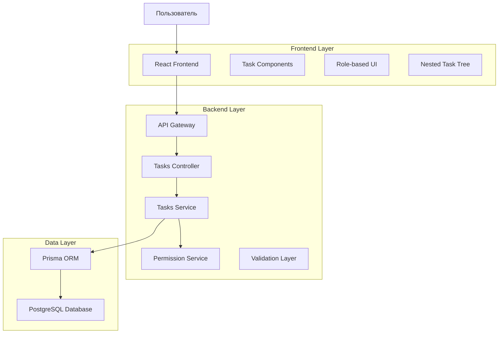
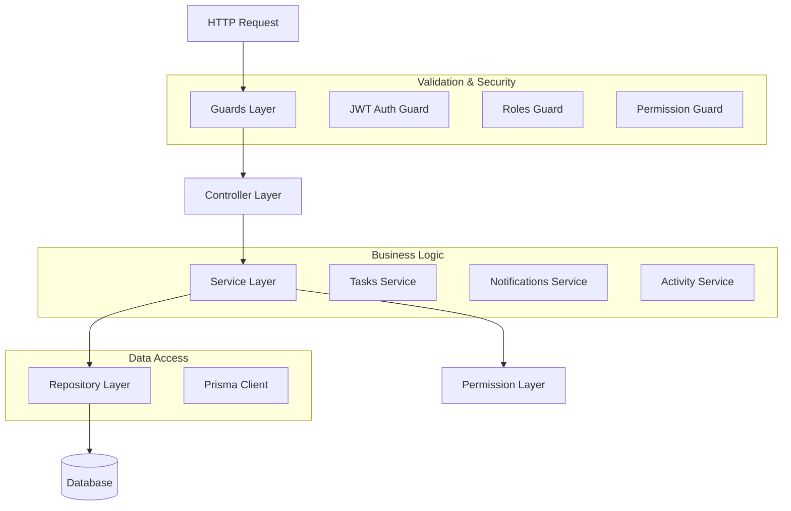
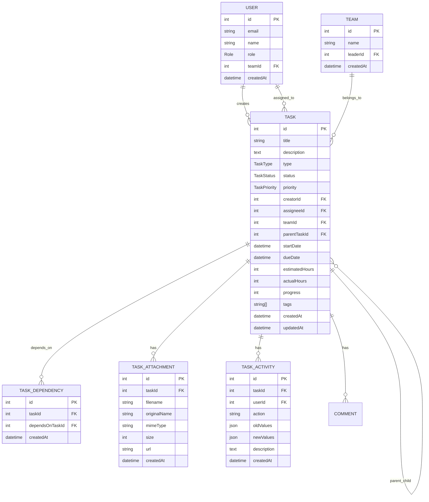

# Техническая архитектура переработки модуля управления задачами

## 1. Архитектурный дизайн



## 2. Описание технологий

- **Frontend**: React@18 + TypeScript + TailwindCSS + Vite
- **Backend**: NestJS + TypeScript + Prisma ORM
- **Database**: PostgreSQL (через Supabase)
- **Authentication**: JWT + Role-based Access Control
- **State Management**: TanStack Query + Zustand
- **UI Components**: Radix UI + Lucide Icons

## 3. Определения маршрутов

| Маршрут | Назначение |
|---------|------------|
| /tasks | Главная страница задач с фильтрами и таблицей |
| /tasks/create | Создание новой задачи |
| /tasks/:id | Детальный просмотр задачи |
| /tasks/:id/edit | Редактирование задачи |
| /tasks/:id/subtasks | Управление подзадачами |
| /tasks/board | Канбан-доска задач |
| /tasks/calendar | Календарный вид задач |

## 4. API определения

### 4.1 Основные API endpoints

#### Создание задачи
```
POST /api/tasks
```

**Request:**
| Параметр | Тип | Обязательный | Описание |
|----------|-----|--------------|----------|
| title | string | true | Название задачи |
| description | string | false | Описание задачи |
| type | TaskType | true | PERSONAL или TEAM |
| priority | TaskPriority | false | LOW, MEDIUM, HIGH, CRITICAL |
| assigneeId | number | false | ID исполнителя |
| parentTaskId | number | false | ID родительской задачи |
| dueDate | string | false | Срок выполнения (ISO date) |
| estimatedHours | number | false | Оценка времени в часах |
| tags | string[] | false | Теги задачи |

**Response:**
```json
{
  "id": 123,
  "title": "Новая задача",
  "status": "TODO",
  "createdAt": "2024-01-15T10:00:00Z",
  "creator": { "id": 1, "name": "Иван Иванов" },
  "assignee": { "id": 2, "name": "Петр Петров" }
}
```

#### Получение задач с фильтрами
```
GET /api/tasks/filtered
```

**Query Parameters:**
| Параметр | Тип | Описание |
|----------|-----|----------|
| status | TaskStatus | Фильтр по статусу |
| priority | TaskPriority | Фильтр по приоритету |
| assigneeId | number | Фильтр по исполнителю |
| parentTaskId | number | Фильтр по родительской задаче |
| search | string | Поиск по названию и описанию |
| tags | string[] | Фильтр по тегам |
| dueDateFrom | string | Начальная дата срока |
| dueDateTo | string | Конечная дата срока |
| sortBy | string | Поле сортировки |
| sortOrder | string | Направление сортировки (asc/desc) |

#### Обновление задачи
```
PUT /api/tasks/:id
```

#### Изменение статуса задачи
```
PATCH /api/tasks/:id/status
```

#### Массовые операции
```
PATCH /api/tasks/bulk
```

**Request:**
```json
{
  "taskIds": [1, 2, 3],
  "action": "updateStatus",
  "data": { "status": "IN_PROGRESS" }
}
```

### 4.2 Права доступа API

#### Проверка прав на создание задачи
```
GET /api/tasks/permissions/create
```

#### Проверка прав на назначение пользователей
```
GET /api/tasks/permissions/assignable-users
```

## 5. Архитектура сервера



## 6. Модель данных

### 6.1 Определение модели данных



### 6.2 DDL (Data Definition Language)

#### Обновление таблицы Task
```sql
-- Добавление новых полей для улучшенной функциональности
ALTER TABLE "Task" ADD COLUMN IF NOT EXISTS "parentTaskId" INTEGER;
ALTER TABLE "Task" ADD COLUMN IF NOT EXISTS "tags" TEXT[];
ALTER TABLE "Task" ADD COLUMN IF NOT EXISTS "progress" INTEGER DEFAULT 0;
ALTER TABLE "Task" ADD COLUMN IF NOT EXISTS "actualHours" INTEGER DEFAULT 0;

-- Создание индексов для производительности
CREATE INDEX IF NOT EXISTS "idx_task_parent" ON "Task"("parentTaskId");
CREATE INDEX IF NOT EXISTS "idx_task_assignee" ON "Task"("assigneeId");
CREATE INDEX IF NOT EXISTS "idx_task_status" ON "Task"("status");
CREATE INDEX IF NOT EXISTS "idx_task_priority" ON "Task"("priority");
CREATE INDEX IF NOT EXISTS "idx_task_due_date" ON "Task"("dueDate");
CREATE INDEX IF NOT EXISTS "idx_task_tags" ON "Task" USING GIN("tags");

-- Добавление внешнего ключа для родительской задачи
ALTER TABLE "Task" ADD CONSTRAINT "fk_task_parent" 
  FOREIGN KEY ("parentTaskId") REFERENCES "Task"("id") ON DELETE CASCADE;
```

#### Создание таблицы зависимостей задач
```sql
CREATE TABLE IF NOT EXISTS "TaskDependency" (
    "id" SERIAL PRIMARY KEY,
    "taskId" INTEGER NOT NULL,
    "dependsOnTaskId" INTEGER NOT NULL,
    "createdAt" TIMESTAMP WITH TIME ZONE DEFAULT NOW(),
    
    CONSTRAINT "fk_dependency_task" FOREIGN KEY ("taskId") 
        REFERENCES "Task"("id") ON DELETE CASCADE,
    CONSTRAINT "fk_dependency_depends_on" FOREIGN KEY ("dependsOnTaskId") 
        REFERENCES "Task"("id") ON DELETE CASCADE,
    CONSTRAINT "unique_dependency" UNIQUE ("taskId", "dependsOnTaskId")
);

CREATE INDEX "idx_task_dependency_task" ON "TaskDependency"("taskId");
CREATE INDEX "idx_task_dependency_depends_on" ON "TaskDependency"("dependsOnTaskId");
```

#### Создание таблицы активности задач
```sql
CREATE TABLE IF NOT EXISTS "TaskActivity" (
    "id" SERIAL PRIMARY KEY,
    "taskId" INTEGER NOT NULL,
    "userId" INTEGER NOT NULL,
    "action" VARCHAR(50) NOT NULL,
    "oldValues" JSONB,
    "newValues" JSONB,
    "description" TEXT,
    "createdAt" TIMESTAMP WITH TIME ZONE DEFAULT NOW(),
    
    CONSTRAINT "fk_activity_task" FOREIGN KEY ("taskId") 
        REFERENCES "Task"("id") ON DELETE CASCADE,
    CONSTRAINT "fk_activity_user" FOREIGN KEY ("userId") 
        REFERENCES "User"("id") ON DELETE CASCADE
);

CREATE INDEX "idx_task_activity_task" ON "TaskActivity"("taskId");
CREATE INDEX "idx_task_activity_created_at" ON "TaskActivity"("createdAt" DESC);
```

#### Обновление прав доступа
```sql
-- Права для анонимных пользователей (только чтение публичных данных)
GRANT SELECT ON "Task" TO anon WHERE "type" = 'PUBLIC';

-- Права для аутентифицированных пользователей
GRANT ALL PRIVILEGES ON "Task" TO authenticated;
GRANT ALL PRIVILEGES ON "TaskDependency" TO authenticated;
GRANT ALL PRIVILEGES ON "TaskActivity" TO authenticated;
GRANT ALL PRIVILEGES ON "TaskAttachment" TO authenticated;

-- Политики безопасности на уровне строк (RLS)
ALTER TABLE "Task" ENABLE ROW LEVEL SECURITY;

-- Политика для чтения задач
CREATE POLICY "task_read_policy" ON "Task" FOR SELECT
    USING (
        -- Пользователь может видеть задачи, которые он создал или которые ему назначены
        "creatorId" = auth.uid()::integer OR 
        "assigneeId" = auth.uid()::integer OR
        -- Лидер команды может видеть все задачи своей команды
        ("teamId" IN (
            SELECT "id" FROM "Team" WHERE "leaderId" = auth.uid()::integer
        )) OR
        -- Администратор может видеть все задачи
        (auth.jwt() ->> 'role' = 'ADMIN')
    );

-- Политика для создания задач
CREATE POLICY "task_create_policy" ON "Task" FOR INSERT
    WITH CHECK (
        -- Обычный пользователь может создавать задачи только себе
        (auth.jwt() ->> 'role' = 'USER' AND "assigneeId" = auth.uid()::integer) OR
        -- Лидер команды может создавать задачи участникам своей команды
        (auth.jwt() ->> 'role' = 'TEAM_LEADER' AND "assigneeId" IN (
            SELECT "id" FROM "User" WHERE "teamId" IN (
                SELECT "id" FROM "Team" WHERE "leaderId" = auth.uid()::integer
            )
        )) OR
        -- Администратор может создавать задачи любому пользователю
        (auth.jwt() ->> 'role' = 'ADMIN')
    );
```

## 7. Система ролей и прав доступа

### 7.1 Определение ролей

```typescript
enum UserRole {
  USER = 'USER',           // Обычный пользователь
  TEAM_LEADER = 'TEAM_LEADER', // Лидер группы
  ADMIN = 'ADMIN'          // Администратор
}

interface Permission {
  resource: string;
  action: string;
  condition?: (user: User, resource: any) => boolean;
}
```

### 7.2 Матрица прав доступа

| Действие | Обычный пользователь | Лидер группы | Администратор |
|----------|---------------------|--------------|---------------|
| Создать задачу себе | ✅ | ✅ | ✅ |
| Создать задачу участнику команды | ❌ | ✅ | ✅ |
| Создать задачу любому пользователю | ❌ | ❌ | ✅ |
| Редактировать свои задачи | ✅ | ✅ | ✅ |
| Редактировать задачи команды | ❌ | ✅ | ✅ |
| Редактировать любые задачи | ❌ | ❌ | ✅ |
| Удалить свои задачи | ✅ | ✅ | ✅ |
| Удалить задачи команды | ❌ | ✅ | ✅ |
| Удалить любые задачи | ❌ | ❌ | ✅ |
| Просмотр задач команды | ❌ | ✅ | ✅ |
| Просмотр всех задач | ❌ | ❌ | ✅ |

## 8. Компоненты фронтенда

### 8.1 Структура компонентов

```
src/features/tasks/
├── components/
│   ├── TaskList/
│   │   ├── TaskList.tsx
│   │   ├── TaskItem.tsx
│   │   └── TaskFilters.tsx
│   ├── TaskTree/
│   │   ├── TaskTree.tsx
│   │   ├── TaskNode.tsx
│   │   └── SubtasksList.tsx
│   ├── TaskForm/
│   │   ├── TaskForm.tsx
│   │   ├── TaskFormFields.tsx
│   │   └── AssigneeSelector.tsx
│   ├── TaskDetails/
│   │   ├── TaskDetails.tsx
│   │   ├── TaskHeader.tsx
│   │   ├── TaskContent.tsx
│   │   └── TaskActivity.tsx
│   └── TaskBoard/
│       ├── TaskBoard.tsx
│       ├── TaskColumn.tsx
│       └── TaskCard.tsx
├── hooks/
│   ├── useTaskPermissions.ts
│   ├── useTaskFilters.ts
│   └── useTaskTree.ts
├── services/
│   ├── taskService.ts
│   └── permissionService.ts
└── types/
    ├── task.types.ts
    └── permission.types.ts
```

### 8.2 Ключевые хуки

```typescript
// useTaskPermissions.ts
export const useTaskPermissions = (user: User) => {
  return {
    canCreateTask: (assigneeId?: number) => {
      if (user.role === 'ADMIN') return true;
      if (user.role === 'TEAM_LEADER') {
        return !assigneeId || isUserInMyTeam(assigneeId, user.teamId);
      }
      return !assigneeId || assigneeId === user.id;
    },
    canEditTask: (task: Task) => {
      if (user.role === 'ADMIN') return true;
      if (user.role === 'TEAM_LEADER' && task.teamId === user.teamId) return true;
      return task.creatorId === user.id || task.assigneeId === user.id;
    },
    canDeleteTask: (task: Task) => {
      if (user.role === 'ADMIN') return true;
      if (user.role === 'TEAM_LEADER' && task.teamId === user.teamId) return true;
      return task.creatorId === user.id;
    }
  };
};
```

## 9. План миграции

### 9.1 Этапы миграции

1. **Этап 1: Подготовка базы данных**
   - Создание новых таблиц и полей
   - Миграция существующих данных
   - Настройка индексов и ограничений

2. **Этап 2: Обновление бэкенда**
   - Обновление моделей Prisma
   - Реализация новых API endpoints
   - Добавление системы прав доступа

3. **Этап 3: Обновление фронтенда**
   - Создание новых компонентов
   - Интеграция с обновленным API
   - Тестирование функциональности

4. **Этап 4: Тестирование и развертывание**
   - Комплексное тестирование
   - Постепенное развертывание
   - Мониторинг и исправление ошибок

### 9.2 Обратная совместимость

- Сохранение существующих API endpoints с пометкой deprecated
- Постепенный переход на новые endpoints
- Миграция данных без потери информации
- Поддержка старых форматов данных в переходный период

## 10. Метрики и мониторинг

### 10.1 Ключевые метрики

- Время отклика API endpoints
- Количество созданных/обновленных задач
- Использование фильтров и поиска
- Ошибки прав доступа
- Производительность запросов к базе данных

### 10.2 Логирование

- Все операции с задачами логируются в TaskActivity
- Ошибки прав доступа логируются отдельно
- Производительность критических запросов отслеживается
- Пользовательские действия записываются для аналитики