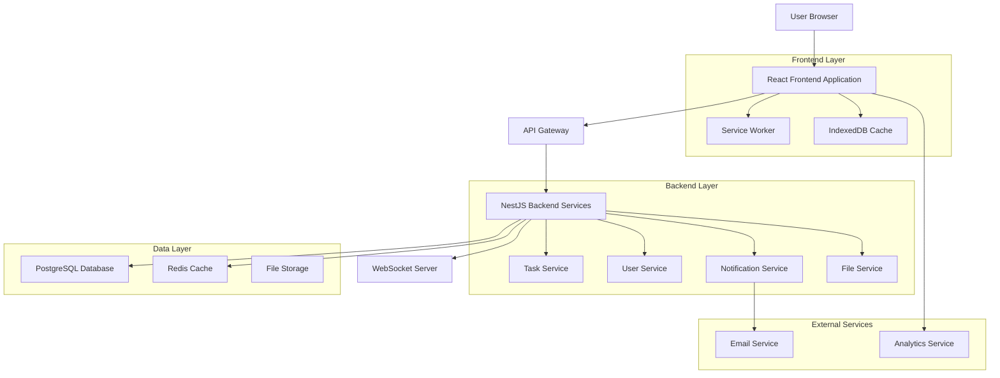
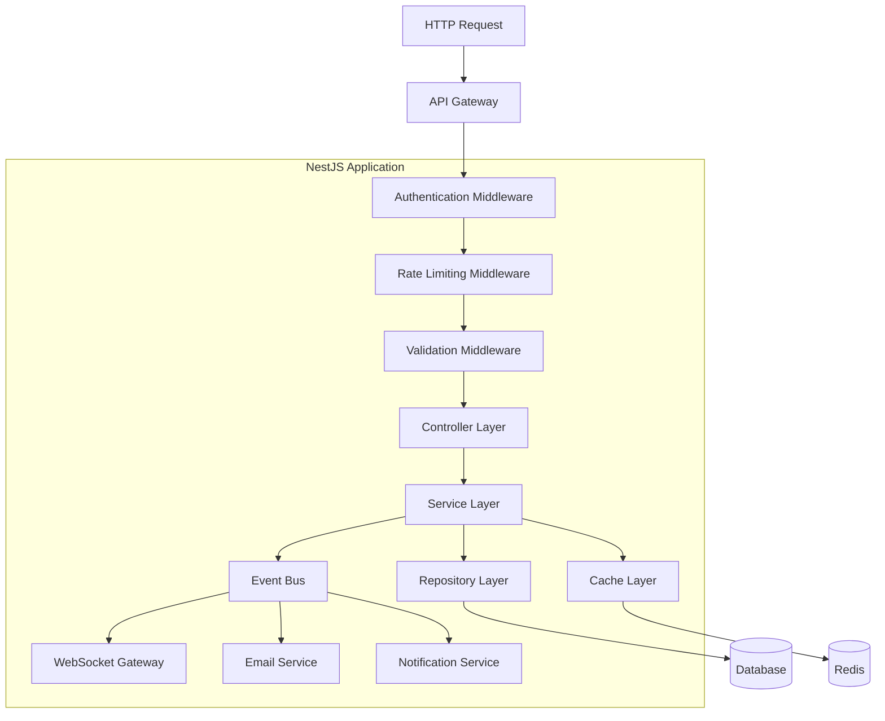
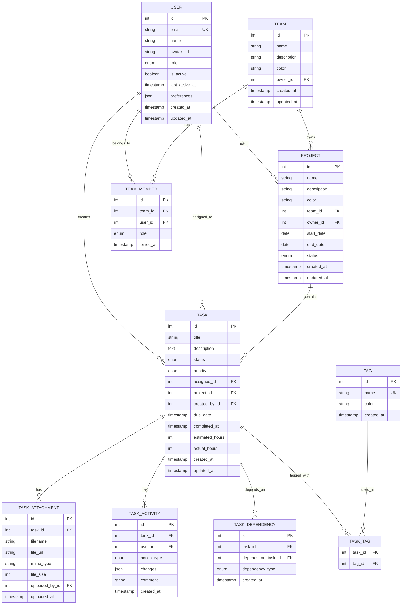

# Техническая архитектура нового менеджера задач

## 1. Архитектурный дизайн



## 2. Описание технологий

### Frontend
- **React 18** с Concurrent Features для оптимальной производительности
- **TypeScript 5.0+** для типобезопасности и лучшего DX
- **Vite** для быстрой разработки и сборки
- **TanStack Query v4** для управления серверным состоянием
- **Zustand** для легковесного клиентского состояния
- **Tailwind CSS** для утилитарной стилизации
- **Radix UI** для доступных базовых компонентов
- **Framer Motion** для плавных анимаций
- **@dnd-kit** для современного drag & drop
- **React Hook Form** для эффективной работы с формами

### Backend
- **NestJS** с модульной архитектурой и dependency injection
- **Prisma ORM** для типобезопасной работы с базой данных
- **PostgreSQL** как основная реляционная база данных
- **Redis** для кеширования и сессий
- **Socket.io** для real-time коммуникации
- **JWT** с refresh tokens для аутентификации
- **Helmet** для безопасности HTTP заголовков
- **@nestjs/throttler** для rate limiting

### DevOps и инфраструктура
- **Docker** для контейнеризации
- **GitHub Actions** для CI/CD
- **ESLint + Prettier** для качества кода
- **Jest + Testing Library** для тестирования
- **Storybook** для документации компонентов

## 3. Определения маршрутов

| Маршрут | Назначение |
|---------|------------|
| `/` | Главная страница с дашбордом и обзором задач |
| `/tasks` | Основная страница управления задачами (таблица) |
| `/tasks/board` | Kanban доска для визуального управления |
| `/tasks/calendar` | Календарное представление задач |
| `/tasks/:id` | Детальная страница задачи |
| `/tasks/create` | Форма создания новой задачи |
| `/projects` | Управление проектами |
| `/projects/:id` | Детальная страница проекта |
| `/teams` | Управление командами |
| `/profile` | Профиль пользователя и настройки |
| `/analytics` | Аналитика и отчеты |
| `/settings` | Системные настройки |

## 4. API определения

### 4.1 Основные API эндпоинты

#### Управление задачами

```typescript
// GET /api/tasks
interface GetTasksRequest {
  page?: number;
  limit?: number;
  status?: TaskStatus[];
  priority?: TaskPriority[];
  assigneeId?: number[];
  projectId?: number;
  search?: string;
  sortBy?: 'createdAt' | 'updatedAt' | 'priority' | 'dueDate';
  sortOrder?: 'asc' | 'desc';
}

interface GetTasksResponse {
  data: Task[];
  pagination: {
    page: number;
    limit: number;
    total: number;
    totalPages: number;
    hasMore: boolean;
  };
  filters: {
    applied: AppliedFilters;
    available: AvailableFilters;
  };
}
```

```typescript
// POST /api/tasks
interface CreateTaskRequest {
  title: string;
  description?: string;
  priority: TaskPriority;
  status: TaskStatus;
  assigneeId?: number;
  projectId?: number;
  dueDate?: string;
  tags?: string[];
  attachments?: File[];
}

interface CreateTaskResponse {
  task: Task;
  message: string;
}
```

```typescript
// PATCH /api/tasks/:id
interface UpdateTaskRequest {
  title?: string;
  description?: string;
  priority?: TaskPriority;
  status?: TaskStatus;
  assigneeId?: number;
  dueDate?: string;
  tags?: string[];
}

interface UpdateTaskResponse {
  task: Task;
  changes: TaskChange[];
  message: string;
}
```

```typescript
// PATCH /api/tasks/bulk
interface BulkUpdateTasksRequest {
  taskIds: number[];
  updates: Partial<Task>;
  action: 'update' | 'delete' | 'archive' | 'duplicate';
}

interface BulkUpdateTasksResponse {
  updatedTasks: Task[];
  failedTasks: { id: number; error: string }[];
  summary: {
    total: number;
    successful: number;
    failed: number;
  };
}
```

#### Управление проектами

```typescript
// GET /api/projects
interface GetProjectsResponse {
  data: Project[];
  pagination: PaginationMeta;
}

// POST /api/projects
interface CreateProjectRequest {
  name: string;
  description?: string;
  color?: string;
  teamId?: number;
  startDate?: string;
  endDate?: string;
}
```

#### Real-time события

```typescript
// WebSocket события
interface TaskUpdatedEvent {
  type: 'TASK_UPDATED';
  payload: {
    taskId: number;
    changes: Partial<Task>;
    updatedBy: {
      id: number;
      name: string;
    };
    timestamp: string;
  };
}

interface TaskCreatedEvent {
  type: 'TASK_CREATED';
  payload: {
    task: Task;
    createdBy: {
      id: number;
      name: string;
    };
    timestamp: string;
  };
}

interface TaskDeletedEvent {
  type: 'TASK_DELETED';
  payload: {
    taskId: number;
    deletedBy: {
      id: number;
      name: string;
    };
    timestamp: string;
  };
}
```

### 4.2 Типы данных

```typescript
// Основные сущности
interface Task {
  id: number;
  title: string;
  description?: string;
  status: TaskStatus;
  priority: TaskPriority;
  assigneeId?: number;
  assignee?: User;
  projectId?: number;
  project?: Project;
  createdById: number;
  createdBy: User;
  dueDate?: string;
  completedAt?: string;
  tags: string[];
  attachments: TaskAttachment[];
  activities: TaskActivity[];
  dependencies: TaskDependency[];
  estimatedHours?: number;
  actualHours?: number;
  createdAt: string;
  updatedAt: string;
}

interface Project {
  id: number;
  name: string;
  description?: string;
  color: string;
  teamId?: number;
  team?: Team;
  ownerId: number;
  owner: User;
  startDate?: string;
  endDate?: string;
  status: ProjectStatus;
  tasksCount: number;
  completedTasksCount: number;
  progress: number;
  createdAt: string;
  updatedAt: string;
}

interface User {
  id: number;
  email: string;
  name: string;
  avatar?: string;
  role: UserRole;
  isActive: boolean;
  lastActiveAt?: string;
  preferences: UserPreferences;
  createdAt: string;
  updatedAt: string;
}

// Перечисления
enum TaskStatus {
  TODO = 'TODO',
  IN_PROGRESS = 'IN_PROGRESS',
  IN_REVIEW = 'IN_REVIEW',
  DONE = 'DONE',
  CANCELLED = 'CANCELLED'
}

enum TaskPriority {
  LOW = 'LOW',
  MEDIUM = 'MEDIUM',
  HIGH = 'HIGH',
  URGENT = 'URGENT'
}

enum ProjectStatus {
  PLANNING = 'PLANNING',
  ACTIVE = 'ACTIVE',
  ON_HOLD = 'ON_HOLD',
  COMPLETED = 'COMPLETED',
  CANCELLED = 'CANCELLED'
}

enum UserRole {
  ADMIN = 'ADMIN',
  MANAGER = 'MANAGER',
  MEMBER = 'MEMBER',
  VIEWER = 'VIEWER'
}
```

## 5. Архитектура сервера



### Слои архитектуры

**Controller Layer (Контроллеры):**
- Обработка HTTP запросов
- Валидация входных данных
- Сериализация ответов
- Обработка ошибок

**Service Layer (Бизнес-логика):**
- Реализация use-cases
- Координация между репозиториями
- Бизнес-валидация
- Управление транзакциями

**Repository Layer (Доступ к данным):**
- Абстракция над базой данных
- Оптимизированные запросы
- Кеширование результатов
- Управление соединениями

## 6. Модель данных

### 6.1 Диаграмма сущностей



### 6.2 DDL (Data Definition Language)

```sql
-- Создание основных таблиц
CREATE TABLE users (
    id SERIAL PRIMARY KEY,
    email VARCHAR(255) UNIQUE NOT NULL,
    name VARCHAR(255) NOT NULL,
    avatar_url TEXT,
    role VARCHAR(20) NOT NULL DEFAULT 'MEMBER',
    is_active BOOLEAN DEFAULT true,
    last_active_at TIMESTAMP WITH TIME ZONE,
    preferences JSONB DEFAULT '{}',
    created_at TIMESTAMP WITH TIME ZONE DEFAULT NOW(),
    updated_at TIMESTAMP WITH TIME ZONE DEFAULT NOW()
);

CREATE TABLE teams (
    id SERIAL PRIMARY KEY,
    name VARCHAR(255) NOT NULL,
    description TEXT,
    color VARCHAR(7) DEFAULT '#3B82F6',
    owner_id INTEGER REFERENCES users(id) ON DELETE CASCADE,
    created_at TIMESTAMP WITH TIME ZONE DEFAULT NOW(),
    updated_at TIMESTAMP WITH TIME ZONE DEFAULT NOW()
);

CREATE TABLE team_members (
    id SERIAL PRIMARY KEY,
    team_id INTEGER REFERENCES teams(id) ON DELETE CASCADE,
    user_id INTEGER REFERENCES users(id) ON DELETE CASCADE,
    role VARCHAR(20) NOT NULL DEFAULT 'MEMBER',
    joined_at TIMESTAMP WITH TIME ZONE DEFAULT NOW(),
    UNIQUE(team_id, user_id)
);

CREATE TABLE projects (
    id SERIAL PRIMARY KEY,
    name VARCHAR(255) NOT NULL,
    description TEXT,
    color VARCHAR(7) DEFAULT '#10B981',
    team_id INTEGER REFERENCES teams(id) ON DELETE SET NULL,
    owner_id INTEGER REFERENCES users(id) ON DELETE CASCADE,
    start_date DATE,
    end_date DATE,
    status VARCHAR(20) NOT NULL DEFAULT 'PLANNING',
    created_at TIMESTAMP WITH TIME ZONE DEFAULT NOW(),
    updated_at TIMESTAMP WITH TIME ZONE DEFAULT NOW()
);

CREATE TABLE tasks (
    id SERIAL PRIMARY KEY,
    title VARCHAR(500) NOT NULL,
    description TEXT,
    status VARCHAR(20) NOT NULL DEFAULT 'TODO',
    priority VARCHAR(20) NOT NULL DEFAULT 'MEDIUM',
    assignee_id INTEGER REFERENCES users(id) ON DELETE SET NULL,
    project_id INTEGER REFERENCES projects(id) ON DELETE SET NULL,
    created_by_id INTEGER REFERENCES users(id) ON DELETE CASCADE,
    due_date TIMESTAMP WITH TIME ZONE,
    completed_at TIMESTAMP WITH TIME ZONE,
    estimated_hours INTEGER,
    actual_hours INTEGER,
    created_at TIMESTAMP WITH TIME ZONE DEFAULT NOW(),
    updated_at TIMESTAMP WITH TIME ZONE DEFAULT NOW()
);

CREATE TABLE task_attachments (
    id SERIAL PRIMARY KEY,
    task_id INTEGER REFERENCES tasks(id) ON DELETE CASCADE,
    filename VARCHAR(255) NOT NULL,
    file_url TEXT NOT NULL,
    mime_type VARCHAR(100),
    file_size INTEGER,
    uploaded_by_id INTEGER REFERENCES users(id) ON DELETE SET NULL,
    uploaded_at TIMESTAMP WITH TIME ZONE DEFAULT NOW()
);

CREATE TABLE task_activities (
    id SERIAL PRIMARY KEY,
    task_id INTEGER REFERENCES tasks(id) ON DELETE CASCADE,
    user_id INTEGER REFERENCES users(id) ON DELETE SET NULL,
    action_type VARCHAR(50) NOT NULL,
    changes JSONB,
    comment TEXT,
    created_at TIMESTAMP WITH TIME ZONE DEFAULT NOW()
);

CREATE TABLE task_dependencies (
    id SERIAL PRIMARY KEY,
    task_id INTEGER REFERENCES tasks(id) ON DELETE CASCADE,
    depends_on_task_id INTEGER REFERENCES tasks(id) ON DELETE CASCADE,
    dependency_type VARCHAR(20) DEFAULT 'BLOCKS',
    created_at TIMESTAMP WITH TIME ZONE DEFAULT NOW(),
    UNIQUE(task_id, depends_on_task_id)
);

CREATE TABLE tags (
    id SERIAL PRIMARY KEY,
    name VARCHAR(100) UNIQUE NOT NULL,
    color VARCHAR(7) DEFAULT '#6B7280',
    created_at TIMESTAMP WITH TIME ZONE DEFAULT NOW()
);

CREATE TABLE task_tags (
    task_id INTEGER REFERENCES tasks(id) ON DELETE CASCADE,
    tag_id INTEGER REFERENCES tags(id) ON DELETE CASCADE,
    PRIMARY KEY (task_id, tag_id)
);

-- Создание индексов для производительности
CREATE INDEX idx_tasks_status ON tasks(status);
CREATE INDEX idx_tasks_priority ON tasks(priority);
CREATE INDEX idx_tasks_assignee ON tasks(assignee_id);
CREATE INDEX idx_tasks_project ON tasks(project_id);
CREATE INDEX idx_tasks_created_by ON tasks(created_by_id);
CREATE INDEX idx_tasks_due_date ON tasks(due_date);
CREATE INDEX idx_tasks_created_at ON tasks(created_at DESC);
CREATE INDEX idx_tasks_updated_at ON tasks(updated_at DESC);

-- Составные индексы для частых запросов
CREATE INDEX idx_tasks_status_priority ON tasks(status, priority);
CREATE INDEX idx_tasks_assignee_status ON tasks(assignee_id, status) WHERE assignee_id IS NOT NULL;
CREATE INDEX idx_tasks_project_status ON tasks(project_id, status) WHERE project_id IS NOT NULL;
CREATE INDEX idx_tasks_created_by_status ON tasks(created_by_id, status);

-- Полнотекстовый поиск
CREATE INDEX idx_tasks_search ON tasks USING gin(to_tsvector('russian', title || ' ' || COALESCE(description, '')));

-- Индексы для активностей
CREATE INDEX idx_task_activities_task ON task_activities(task_id, created_at DESC);
CREATE INDEX idx_task_activities_user ON task_activities(user_id, created_at DESC);

-- Индексы для команд и проектов
CREATE INDEX idx_team_members_team ON team_members(team_id);
CREATE INDEX idx_team_members_user ON team_members(user_id);
CREATE INDEX idx_projects_team ON projects(team_id);
CREATE INDEX idx_projects_owner ON projects(owner_id);

-- Функция для автоматического обновления updated_at
CREATE OR REPLACE FUNCTION update_updated_at_column()
RETURNS TRIGGER AS $$
BEGIN
    NEW.updated_at = NOW();
    RETURN NEW;
END;
$$ language 'plpgsql';

-- Триггеры для автоматического обновления updated_at
CREATE TRIGGER update_users_updated_at BEFORE UPDATE ON users FOR EACH ROW EXECUTE FUNCTION update_updated_at_column();
CREATE TRIGGER update_teams_updated_at BEFORE UPDATE ON teams FOR EACH ROW EXECUTE FUNCTION update_updated_at_column();
CREATE TRIGGER update_projects_updated_at BEFORE UPDATE ON projects FOR EACH ROW EXECUTE FUNCTION update_updated_at_column();
CREATE TRIGGER update_tasks_updated_at BEFORE UPDATE ON tasks FOR EACH ROW EXECUTE FUNCTION update_updated_at_column();

-- Начальные данные
INSERT INTO tags (name, color) VALUES
('Bug', '#EF4444'),
('Feature', '#10B981'),
('Enhancement', '#3B82F6'),
('Documentation', '#8B5CF6'),
('Testing', '#F59E0B'),
('Urgent', '#DC2626'),
('Backend', '#6366F1'),
('Frontend', '#06B6D4'),
('Design', '#EC4899'),
('Research', '#84CC16');

-- Представления для аналитики
CREATE VIEW task_statistics AS
SELECT 
    t.status,
    t.priority,
    COUNT(*) as count,
    AVG(EXTRACT(EPOCH FROM (COALESCE(t.completed_at, NOW()) - t.created_at))/3600) as avg_completion_hours,
    COUNT(CASE WHEN t.due_date < NOW() AND t.status != 'DONE' THEN 1 END) as overdue_count
FROM tasks t
GROUP BY t.status, t.priority;

CREATE VIEW project_progress AS
SELECT 
    p.id,
    p.name,
    COUNT(t.id) as total_tasks,
    COUNT(CASE WHEN t.status = 'DONE' THEN 1 END) as completed_tasks,
    ROUND(
        CASE 
            WHEN COUNT(t.id) > 0 
            THEN (COUNT(CASE WHEN t.status = 'DONE' THEN 1 END)::float / COUNT(t.id)::float) * 100
            ELSE 0
        END, 2
    ) as progress_percentage
FROM projects p
LEFT JOIN tasks t ON p.id = t.project_id
GROUP BY p.id, p.name;
```

## 7. Кеширование и оптимизация

### 7.1 Стратегия кеширования

**Уровни кеширования:**
1. **Browser Cache** - статические ресурсы (24 часа)
2. **Service Worker** - API ответы (1 час)
3. **React Query** - серверное состояние (5 минут)
4. **Redis** - часто запрашиваемые данные (30 минут)
5. **Database Query Cache** - результаты запросов (15 минут)

**Ключи кеширования:**
```typescript
// Паттерны ключей Redis
const CACHE_KEYS = {
  USER_TASKS: (userId: number) => `user:${userId}:tasks`,
  PROJECT_TASKS: (projectId: number) => `project:${projectId}:tasks`,
  TASK_DETAILS: (taskId: number) => `task:${taskId}:details`,
  USER_PERMISSIONS: (userId: number) => `user:${userId}:permissions`,
  TEAM_MEMBERS: (teamId: number) => `team:${teamId}:members`
};

// TTL (Time To Live) настройки
const CACHE_TTL = {
  USER_TASKS: 300, // 5 минут
  PROJECT_TASKS: 600, // 10 минут
  TASK_DETAILS: 1800, // 30 минут
  USER_PERMISSIONS: 3600, // 1 час
  TEAM_MEMBERS: 1800 // 30 минут
};
```

### 7.2 Оптимизация запросов

**Пагинация с курсорами:**
```sql
-- Эффективная пагинация для больших таблиц
SELECT t.*, u.name as assignee_name, p.name as project_name
FROM tasks t
LEFT JOIN users u ON t.assignee_id = u.id
LEFT JOIN projects p ON t.project_id = p.id
WHERE t.id > $1 -- cursor
ORDER BY t.id
LIMIT $2;
```

**Оптимизированные JOIN запросы:**
```sql
-- Получение задач с минимальным количеством запросов
SELECT 
    t.*,
    u.name as assignee_name,
    u.avatar_url as assignee_avatar,
    p.name as project_name,
    p.color as project_color,
    cb.name as created_by_name,
    COALESCE(tag_agg.tags, '[]'::json) as tags,
    COALESCE(att_count.count, 0) as attachments_count
FROM tasks t
LEFT JOIN users u ON t.assignee_id = u.id
LEFT JOIN projects p ON t.project_id = p.id
LEFT JOIN users cb ON t.created_by_id = cb.id
LEFT JOIN (
    SELECT 
        tt.task_id,
        json_agg(json_build_object('id', tg.id, 'name', tg.name, 'color', tg.color)) as tags
    FROM task_tags tt
    JOIN tags tg ON tt.tag_id = tg.id
    GROUP BY tt.task_id
) tag_agg ON t.id = tag_agg.task_id
LEFT JOIN (
    SELECT task_id, COUNT(*) as count
    FROM task_attachments
    GROUP BY task_id
) att_count ON t.id = att_count.task_id
WHERE t.status = ANY($1)
ORDER BY t.updated_at DESC
LIMIT $2 OFFSET $3;
```

## 8. Безопасность

### 8.1 Аутентификация и авторизация

```typescript
// JWT стратегия с refresh tokens
@Injectable()
export class JwtStrategy extends PassportStrategy(Strategy) {
  constructor(private configService: ConfigService) {
    super({
      jwtFromRequest: ExtractJwt.fromAuthHeaderAsBearerToken(),
      ignoreExpiration: false,
      secretOrKey: configService.get('JWT_SECRET'),
    });
  }

  async validate(payload: JwtPayload) {
    return {
      userId: payload.sub,
      email: payload.email,
      role: payload.role,
    };
  }
}

// Защита эндпоинтов с проверкой ролей
@Controller('tasks')
@UseGuards(JwtAuthGuard)
export class TasksController {
  @Get()
  @Roles(UserRole.MEMBER, UserRole.MANAGER, UserRole.ADMIN)
  @UseGuards(RolesGuard)
  async getTasks(@Request() req, @Query() query: GetTasksDto) {
    return this.tasksService.findAll(req.user.userId, query);
  }

  @Post()
  @Roles(UserRole.MEMBER, UserRole.MANAGER, UserRole.ADMIN)
  @UseGuards(RolesGuard, TaskAccessGuard)
  async createTask(@Request() req, @Body() createTaskDto: CreateTaskDto) {
    return this.tasksService.create(req.user.userId, createTaskDto);
  }
}
```

### 8.2 Rate Limiting и защита

```typescript
// Настройка rate limiting
@Module({
  imports: [
    ThrottlerModule.forRoot({
      ttl: 60, // 1 минута
      limit: 100, // 100 запросов в минуту
    }),
  ],
})
export class AppModule {}

// Кастомные лимиты для разных эндпоинтов
@Controller('tasks')
@UseGuards(ThrottlerGuard)
export class TasksController {
  @Post()
  @Throttle(10, 60) // 10 создания задач в минуту
  async createTask(@Body() createTaskDto: CreateTaskDto) {
    return this.tasksService.create(createTaskDto);
  }

  @Post('bulk')
  @Throttle(5, 60) // 5 массовых операций в минуту
  async bulkUpdate(@Body() bulkUpdateDto: BulkUpdateDto) {
    return this.tasksService.bulkUpdate(bulkUpdateDto);
  }
}
```

### 8.3 Валидация и санитизация

```typescript
// DTO с валидацией
export class CreateTaskDto {
  @IsString()
  @Length(1, 500)
  @Transform(({ value }) => value.trim())
  title: string;

  @IsOptional()
  @IsString()
  @MaxLength(5000)
  @Transform(({ value }) => value?.trim())
  description?: string;

  @IsEnum(TaskPriority)
  priority: TaskPriority;

  @IsEnum(TaskStatus)
  status: TaskStatus;

  @IsOptional()
  @IsInt()
  @Min(1)
  assigneeId?: number;

  @IsOptional()
  @IsDateString()
  dueDate?: string;

  @IsOptional()
  @IsArray()
  @ArrayMaxSize(10)
  @IsString({ each: true })
  @Length(1, 50, { each: true })
  tags?: string[];
}
```

Эта техническая архитектура обеспечивает:
- **Масштабируемость** через модульную структуру
- **Производительность** через многоуровневое кеширование
- **Безопасность** через комплексную систему защиты
- **Надежность** через типобезопасность и валидацию
- **Поддерживаемость** через чистую архитектуру