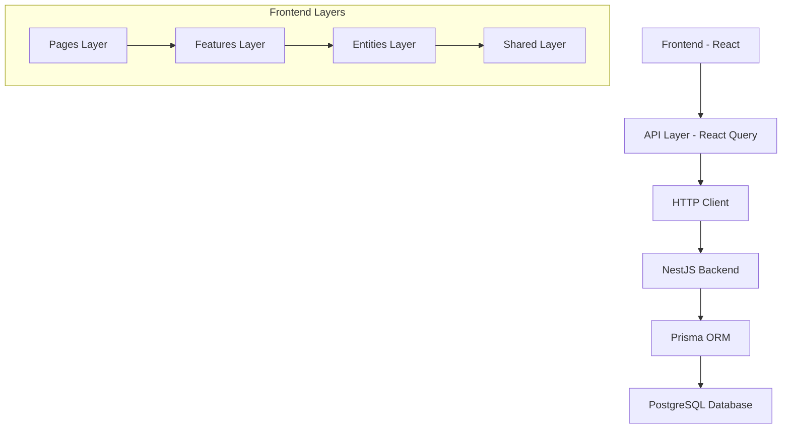

# Комплексный архитектурный анализ модуля "Задачи"

## 1. Анализ текущей архитектуры и кодовой базы

### 1.1 Общая архитектура системы

Модуль задач построен по принципу Feature-Sliced Design с разделением на слои:



### 1.2 Структура модуля задач

**Frontend структура:**
- `src/features/tasks/api/` - API слой с React Query хуками
- `src/features/tasks/ui/` - UI компоненты (TasksTable, TaskDetails, TaskAttachments)
- `src/entities/task/model/` - Типы и модели данных
- `src/pages/tasks/` - Страничный слой

**Backend структура:**
- `src/tasks/tasks.controller.ts` - REST API контроллер
- `src/tasks/tasks.service.ts` - Бизнес-логика
- `src/tasks/dtos/` - DTO для валидации данных
- `src/tasks/tasks.module.ts` - Модуль NestJS

### 1.3 Модель данных

**Основные сущности:**
- `Task` - центральная сущность с полями: title, description, status, priority, dueDate
- `TaskAttachment` - файловые вложения
- `TaskActivity` - история изменений
- `TaskTag` - система тегов
- `TaskDependency` - зависимости между задачами

**Связи:**
- Task → User (creator, assignee)
- Task → Team (для командных задач)
- Task → Task (parent-child для подзадач)

## 2. Выявление ключевых проблем

### 2.1 Архитектурные проблемы

#### 2.1.1 Нарушение принципов Clean Architecture
- **Проблема**: Прямая зависимость UI компонентов от конкретных API эндпоинтов
- **Пример**: `TasksTable.tsx` напрямую использует хуки из `tasks-api.ts`
- **Влияние**: Сложность тестирования, жесткая связанность

#### 2.1.2 Отсутствие Domain Layer
- **Проблема**: Бизнес-логика размазана между сервисами и компонентами
- **Пример**: Логика валидации статусов задач дублируется в UI и backend
- **Влияние**: Сложность поддержки, дублирование кода

#### 2.1.3 Неконсистентная обработка ошибок
- **Проблема**: Разные подходы к обработке ошибок в разных частях системы
- **Пример**: В `tasks-api.ts` используется try-catch, в компонентах - React Query error states
- **Влияние**: Непредсказуемое поведение, плохой UX

### 2.2 Проблемы производительности

#### 2.2.1 N+1 запросы в базе данных
- **Проблема**: При загрузке списка задач делаются дополнительные запросы для каждой задачи
- **Код**: `tasks.service.ts:204-257` - метод `findAllWithFilters`
- **Влияние**: Медленная загрузка списка задач при большом количестве

#### 2.2.2 Отсутствие пагинации
- **Проблема**: Загружаются все задачи сразу
- **Влияние**: Медленная загрузка, высокое потребление памяти

#### 2.2.3 Избыточные ре-рендеры в React
- **Проблема**: `TasksTable.tsx` ре-рендерится при изменении любой задачи
- **Причина**: Отсутствие мемоизации, неоптимальная структура state
- **Влияние**: Лаги в UI при работе с большим количеством задач

### 2.3 Проблемы масштабируемости

#### 2.3.1 Монолитная структура компонентов
- **Проблема**: `TasksTable.tsx` (631 строка) содержит слишком много ответственностей
- **Функции**: Отображение, редактирование, создание, массовые операции
- **Влияние**: Сложность поддержки, тестирования

#### 2.3.2 Отсутствие кеширования
- **Проблема**: Нет стратегии кеширования для часто запрашиваемых данных
- **Влияние**: Лишние запросы к серверу

#### 2.3.3 Жестко закодированные лимиты
- **Проблема**: Лимит на 5 файлов в `tasks.controller.ts:95`
- **Влияние**: Невозможность гибкой настройки

### 2.4 Проблемы безопасности

#### 2.4.1 Недостаточная валидация прав доступа
- **Проблема**: Проверка прав происходит только на уровне сервиса
- **Риск**: Возможность обхода через прямые API вызовы

#### 2.4.2 Отсутствие rate limiting
- **Проблема**: Нет ограничений на количество запросов
- **Риск**: Возможность DDoS атак

### 2.5 Проблемы пользовательского опыта

#### 2.5.1 Отсутствие оптимистичных обновлений
- **Проблема**: UI блокируется на время выполнения операций
- **Влияние**: Медленный отклик интерфейса

#### 2.5.2 Неинформативные состояния загрузки
- **Проблема**: Простые спиннеры без контекста
- **Влияние**: Плохой UX при долгих операциях

## 3. Предложение оптимальных архитектурных решений

### 3.1 Внедрение Clean Architecture

#### 3.1.1 Структура слоев
```
src/
├── domains/
│   └── tasks/
│       ├── entities/          # Бизнес-сущности
│       ├── use-cases/         # Бизнес-логика
│       ├── repositories/      # Интерфейсы репозиториев
│       └── services/          # Доменные сервисы
├── infrastructure/
│   ├── api/                   # HTTP клиенты
│   ├── repositories/          # Реализации репозиториев
│   └── cache/                 # Кеширование
├── presentation/
│   ├── components/            # UI компоненты
│   ├── hooks/                 # Кастомные хуки
│   └── stores/                # State management
```

#### 3.1.2 Доменные сущности
```typescript
// domains/tasks/entities/Task.ts
export class Task {
  constructor(
    private readonly id: TaskId,
    private title: TaskTitle,
    private status: TaskStatus,
    private priority: TaskPriority
  ) {}

  public changeStatus(newStatus: TaskStatus): void {
    if (!this.canChangeStatusTo(newStatus)) {
      throw new InvalidStatusTransitionError();
    }
    this.status = newStatus;
  }

  private canChangeStatusTo(status: TaskStatus): boolean {
    // Бизнес-правила смены статуса
  }
}
```

### 3.2 Оптимизация производительности

#### 3.2.1 Внедрение пагинации
```typescript
// API с пагинацией
export interface TasksQuery {
  page: number;
  limit: number;
  filters?: TaskFilters;
}

export interface TasksResponse {
  tasks: Task[];
  total: number;
  hasMore: boolean;
}
```

#### 3.2.2 Оптимизация запросов к БД
```sql
-- Оптимизированный запрос с JOIN
SELECT t.*, u.name as creator_name, a.name as assignee_name
FROM tasks t
LEFT JOIN users u ON t.creator_id = u.id
LEFT JOIN users a ON t.assignee_id = a.id
WHERE t.status = $1
ORDER BY t.priority DESC, t.due_date ASC
LIMIT $2 OFFSET $3;
```

#### 3.2.3 React оптимизации
```typescript
// Мемоизированный компонент задачи
const TaskRow = React.memo(({ task, onUpdate }: TaskRowProps) => {
  const handleStatusChange = useCallback(
    (status: TaskStatus) => onUpdate(task.id, { status }),
    [task.id, onUpdate]
  );
  
  return (
    // JSX
  );
});
```

### 3.3 Внедрение кеширования

#### 3.3.1 Многоуровневое кеширование
```typescript
// Redis кеш для часто запрашиваемых данных
@Injectable()
export class TasksCacheService {
  async getTasksList(userId: number, filters: TaskFilters): Promise<Task[]> {
    const cacheKey = `tasks:${userId}:${JSON.stringify(filters)}`;
    
    let tasks = await this.redis.get(cacheKey);
    if (!tasks) {
      tasks = await this.tasksRepository.findWithFilters(userId, filters);
      await this.redis.setex(cacheKey, 300, JSON.stringify(tasks)); // 5 min
    }
    
    return JSON.parse(tasks);
  }
}
```

#### 3.3.2 React Query оптимизация
```typescript
export const useTasksQuery = (filters: TaskFilters) => {
  return useQuery({
    queryKey: ['tasks', filters],
    queryFn: () => tasksApi.getTasks(filters),
    staleTime: 5 * 60 * 1000, // 5 минут
    cacheTime: 10 * 60 * 1000, // 10 минут
    keepPreviousData: true,
  });
};
```

### 3.4 Улучшение безопасности

#### 3.4.1 Middleware для проверки прав
```typescript
@Injectable()
export class TaskAccessGuard implements CanActivate {
  canActivate(context: ExecutionContext): boolean {
    const request = context.switchToHttp().getRequest();
    const user = request.user;
    const taskId = request.params.id;
    
    return this.taskPermissionService.canAccess(user, taskId);
  }
}
```

#### 3.4.2 Rate limiting
```typescript
@Controller('tasks')
@UseGuards(ThrottlerGuard)
@Throttle(100, 60) // 100 запросов в минуту
export class TasksController {
  // ...
}
```

### 3.5 Улучшение UX

#### 3.5.1 Оптимистичные обновления
```typescript
export const useOptimisticTaskUpdate = () => {
  const queryClient = useQueryClient();
  
  return useMutation({
    mutationFn: updateTask,
    onMutate: async (variables) => {
      // Отменяем исходящие запросы
      await queryClient.cancelQueries(['tasks']);
      
      // Сохраняем предыдущее состояние
      const previousTasks = queryClient.getQueryData(['tasks']);
      
      // Оптимистично обновляем
      queryClient.setQueryData(['tasks'], (old: Task[]) => 
        old.map(task => 
          task.id === variables.id 
            ? { ...task, ...variables.updates }
            : task
        )
      );
      
      return { previousTasks };
    },
    onError: (err, variables, context) => {
      // Откатываем при ошибке
      queryClient.setQueryData(['tasks'], context?.previousTasks);
    },
  });
};
```

## 4. Поэтапный план модернизации

### Этап 1: Рефакторинг архитектуры (4-6 недель)

#### Неделя 1-2: Создание доменного слоя
- [ ] Создать доменные сущности (Task, TaskStatus, TaskPriority)
- [ ] Реализовать use-cases для основных операций
- [ ] Создать интерфейсы репозиториев
- [ ] Написать unit-тесты для доменной логики

#### Неделя 3-4: Рефакторинг API слоя
- [ ] Создать абстракции для API клиентов
- [ ] Реализовать репозитории
- [ ] Добавить обработку ошибок
- [ ] Внедрить валидацию данных

#### Неделя 5-6: Рефакторинг UI компонентов
- [ ] Разбить монолитные компоненты
- [ ] Создать переиспользуемые UI элементы
- [ ] Добавить мемоизацию
- [ ] Оптимизировать ре-рендеры

### Этап 2: Оптимизация производительности (3-4 недели)

#### Неделя 1: База данных
- [ ] Добавить индексы для часто используемых запросов
- [ ] Оптимизировать N+1 запросы
- [ ] Внедрить connection pooling
- [ ] Добавить мониторинг производительности БД

#### Неделя 2: Кеширование
- [ ] Настроить Redis
- [ ] Реализовать кеширование списков задач
- [ ] Добавить инвалидацию кеша
- [ ] Настроить кеширование на уровне HTTP

#### Неделя 3: Frontend оптимизации
- [ ] Внедрить виртуализацию для больших списков
- [ ] Добавить lazy loading для компонентов
- [ ] Оптимизировать bundle size
- [ ] Внедрить Service Worker для кеширования

#### Неделя 4: Пагинация и фильтрация
- [ ] Реализовать серверную пагинацию
- [ ] Добавить продвинутые фильтры
- [ ] Внедрить поиск по задачам
- [ ] Оптимизировать загрузку данных

### Этап 3: Улучшение безопасности (2-3 недели)

#### Неделя 1: Авторизация и аутентификация
- [ ] Усилить проверку прав доступа
- [ ] Добавить RBAC (Role-Based Access Control)
- [ ] Внедрить JWT refresh tokens
- [ ] Добавить логирование действий пользователей

#### Неделя 2: Защита API
- [ ] Внедрить rate limiting
- [ ] Добавить CORS настройки
- [ ] Реализовать input sanitization
- [ ] Добавить HTTPS принуждение

#### Неделя 3: Мониторинг и аудит
- [ ] Настроить мониторинг безопасности
- [ ] Добавить алерты на подозрительную активность
- [ ] Реализовать audit log
- [ ] Провести security testing

### Этап 4: Улучшение UX (2-3 недели)

#### Неделя 1: Интерактивность
- [ ] Внедрить оптимистичные обновления
- [ ] Добавить drag & drop для задач
- [ ] Реализовать bulk operations
- [ ] Улучшить состояния загрузки

#### Неделя 2: Уведомления и фидбек
- [ ] Добавить toast уведомления
- [ ] Реализовать real-time обновления
- [ ] Улучшить error handling в UI
- [ ] Добавить прогресс-бары для долгих операций

#### Неделя 3: Доступность и адаптивность
- [ ] Улучшить accessibility (a11y)
- [ ] Оптимизировать для мобильных устройств
- [ ] Добавить keyboard shortcuts
- [ ] Реализовать темную тему

### Этап 5: Тестирование и документация (2 недели)

#### Неделя 1: Тестирование
- [ ] Написать integration тесты
- [ ] Добавить E2E тесты
- [ ] Провести performance тестирование
- [ ] Реализовать автоматизированное тестирование

#### Неделя 2: Документация и деплой
- [ ] Обновить API документацию
- [ ] Создать руководство по разработке
- [ ] Настроить CI/CD pipeline
- [ ] Провести финальное тестирование

## 5. Метрики успеха

### 5.1 Производительность
- Время загрузки списка задач: < 500ms
- Время отклика API: < 200ms
- Bundle size: уменьшение на 30%
- Memory usage: уменьшение на 25%

### 5.2 Качество кода
- Test coverage: > 80%
- Code complexity: снижение на 40%
- Technical debt: уменьшение на 50%
- Bug rate: снижение на 60%

### 5.3 Пользовательский опыт
- Time to interactive: < 2s
- Error rate: < 1%
- User satisfaction: > 4.5/5
- Task completion time: уменьшение на 20%

## 6. Риски и митигация

### 6.1 Технические риски
- **Риск**: Поломка существующего функционала
- **Митигация**: Поэтапное внедрение, feature flags, откат

### 6.2 Временные риски
- **Риск**: Превышение временных рамок
- **Митигация**: Agile подход, регулярные ретроспективы

### 6.3 Ресурсные риски
- **Риск**: Недостаток экспертизы
- **Митигация**: Обучение команды, консультации экспертов

## Заключение

Предложенный план модернизации позволит:
1. Улучшить архитектуру и поддерживаемость кода
2. Значительно повысить производительность системы
3. Усилить безопасность приложения
4. Улучшить пользовательский опыт
5. Подготовить систему к масштабированию

Реализация плана потребует 13-16 недель и позволит создать современную, масштабируемую и производительную систему управления задачами.